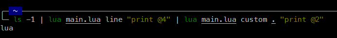
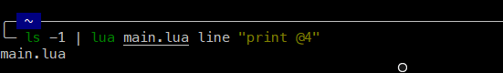
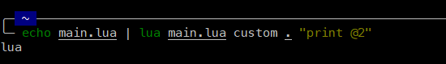

# Console Command Parser
***This is used to parse some information from the command-line***

##### Example

### To break text line by line use the `line` keyword

### To break text by space use the `space` keyword

### To break text by a custom character

### Advanced way to use
